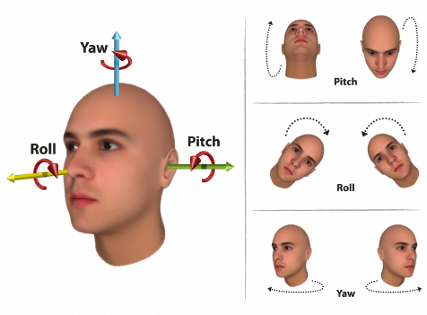

# Head-Pose-Estimation

## Objective

Head Pose Estimation means detecting the position of the the human's head in the image. Particularly, it means detecting the head's Euler angles: `YAW`, `PITCH` and `ROLL`.

## Dataset

AFLW2000-3D is a dataset of 2000 images that have been annotated with image-level 68-point 3D facial landmarks. This dataset is used for evaluation of 3D facial landmark detection models.

## Steps

1- Extract the facial landmarks using MediaPipe for the AFLW2000 dataset.

2- use the annotaded YAW, PITCH and ROLL values included in the data as the labels.

3- Create SVR Model to predict the YAW, PITCH and ROLL values of an image.

4- Test the model on an image and draw predictions.

## Result of testing the model on video with many position
https://drive.google.com/file/d/14ZppzPxEDV0s73Kwfxtf4tsZJfHTgVm0/view?usp=sharing

Made with :heart: by <a href="https://github.com/esraasayed98" target="_blank">Esraa Sayed</a> 